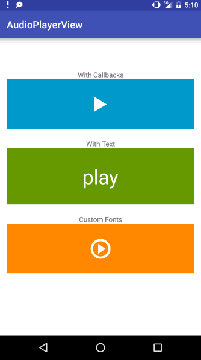

# AudioPlayerView

[](https://android-arsenal.com/details/1/3140)
[](https://github.com/sindresorhus/awesome)
[](https://jitpack.io/#HugoMatilla/AudioPlayerView)


AudioPlayerView is an Android view that loads audio from an url and have basic playback tools.

It makes use of the Android [MediaPlayer](http://developer.android.com/intl/es/reference/android/media/MediaPlayer.html) library.

  

_Unfortunately this gif doesn't play audio :) check the sample app to hear it._

## Update from 1.0.0 to 1.0.1
Change the package repository to jitpack as explained in next section.
## Include

Include the Gradle dependency from `jitpack`

```java

    allprojects {
        repositories {
            ...
            maven { url "https://jitpack.io" }
        }
    }

    dependencies {
        ...
        compile 'com.github.HugoMatilla:AudioPlayerView:v1.0.1'
    }
```

## Permissions

AudioPlayerView adds automatically the `android.permission.INTERNET`  permission.

## Use

Add the view to your xml.

```xml

    <com.hugomatilla.audioplayerview.AudioPlayerView
                android:id="@+id/player"
                ...
    />
```

Use it in your Activity, Fragment or Custom View
```java
    
    String url = "url-to-your-mp3-file.mp3"
    AudioPlayerView audioPlayerView = (AudioPlayerView) findViewById(R.id.player);
    audioPlayerView.withUrl(url);
```

## Callbacks
There are 3 callbacks:

`onAudioPreparing`: while the file is being downloaded. Use it if you want to show a progress dialog.

`onAudioReady`: when the file has finished to be downloaded and is about to start playing. You can use it to hide the progress dialog.

`onAudioFinished`: When the audio has finished playing and is stopped.

```java
    
    audioPlayerView.setOnAudioPlayerViewListener(new AudioPlayerView.OnAudioPlayerViewListener() {
            @Override
            public void onAudioPreparing() {
                spinner.setVisibility(View.VISIBLE);
            }

            @Override
            public void onAudioReady() {
                spinner.setVisibility(View.INVISIBLE);
            }

            @Override
            public void onAudioFinished() {

            }
        });
```

## UI
You can use icons or texts to show the current state of the view: loading, playing or stopped.

The AudioPlayerView extends TextView, so you can do all of the things you would do in a TextView with some considerations.

### Icons
For the icons, AudioPlayerView uses icon fonts. When the audio is ready and playing it shows a stop icon, when is finished or it was never started it shows a play button and when is preparing it shows a spinner (spinning).

The spinner icon makes the whole _textView_ spin, so if it has a background color and it is not a round shape you probably won't get what you expected (the icon to spin) but you will see the whole rectagle spinning. In the sample application you can see how to do it.

### Text
If you prefer to use text, add the texts to the xml file, and `app:useIcons="false"`.

```xml

    <com.hugomatilla.audioplayerview.AudioPlayerView
        ...
        app:loadingText="loading..."
        app:playText="play"
        app:stopText="stop"
        app:useIcons="false"
    />
``` 

### Custom Icons

You can use your own icon fonts.

```xml

    <com.hugomatilla.audioplayerview.lib.AudioPlayerView
        ...
        app:loadingText="@string/customLoadingIcon"
        app:playText="@string/customPlayIcon"
        app:stopText="@string/customStopIcon"
        app:useIcons="true"
    />
``` 

You can create your own icon fonts with [fontello.com](http://fontello.com/)

## API 

The only public method to manage the audio playback is `toggleAudio()` 

It plays the audio if it is stopped or it was never started (previous load), and it stops the audio if it is playing. 

## Destroy

Dont forget to destroy the AudioPlayerView when you don't need it anymore. The `onDestroy()` method of the activity is a good place to have it.

```java

    @Override
    protected void onDestroy() {
        audioPlayerView.destroy();
        super.onDestroy();
    }
```

## License
The MIT License (MIT)

Copyright (c) 2016 Hugo Matilla

Permission is hereby granted, free of charge, to any person obtaining a copy
of this software and associated documentation files (the "Software"), to deal
in the Software without restriction, including without limitation the rights
to use, copy, modify, merge, publish, distribute, sublicense, and/or sell
copies of the Software, and to permit persons to whom the Software is
furnished to do so, subject to the following conditions:

The above copyright notice and this permission notice shall be included in all
copies or substantial portions of the Software.

THE SOFTWARE IS PROVIDED "AS IS", WITHOUT WARRANTY OF ANY KIND, EXPRESS OR
IMPLIED, INCLUDING BUT NOT LIMITED TO THE WARRANTIES OF MERCHANTABILITY,
FITNESS FOR A PARTICULAR PURPOSE AND NONINFRINGEMENT. IN NO EVENT SHALL THE
AUTHORS OR COPYRIGHT HOLDERS BE LIABLE FOR ANY CLAIM, DAMAGES OR OTHER
LIABILITY, WHETHER IN AN ACTION OF CONTRACT, TORT OR OTHERWISE, ARISING FROM,
OUT OF OR IN CONNECTION WITH THE SOFTWARE OR THE USE OR OTHER DEALINGS IN THE
SOFTWARE.
